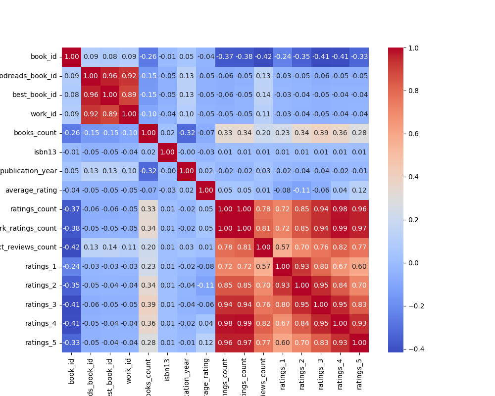

# Dataset Analysis Report
## Data Summary
```
           book_id  goodreads_book_id  best_book_id  ...      ratings_3     ratings_4     ratings_5
count  10000.00000       1.000000e+04  1.000000e+04  ...   10000.000000  1.000000e+04  1.000000e+04
mean    5000.50000       5.264697e+06  5.471214e+06  ...   11475.893800  1.996570e+04  2.378981e+04
std     2886.89568       7.575462e+06  7.827330e+06  ...   28546.449183  5.144736e+04  7.976889e+04
min        1.00000       1.000000e+00  1.000000e+00  ...     323.000000  7.500000e+02  7.540000e+02
25%     2500.75000       4.627575e+04  4.791175e+04  ...    3112.000000  5.405750e+03  5.334000e+03
50%     5000.50000       3.949655e+05  4.251235e+05  ...    4894.000000  8.269500e+03  8.836000e+03
75%     7500.25000       9.382225e+06  9.636112e+06  ...    9287.000000  1.602350e+04  1.730450e+04
max    10000.00000       3.328864e+07  3.553423e+07  ...  793319.000000  1.481305e+06  3.011543e+06

[8 rows x 16 columns]
```
## Insights from AI Analysis
Based on the dataset summary provided, here are some insights and analyses regarding the collection of books:

### General Overview:
1. **Number of Books**: The data includes 10 entries, each representing a unique book.
2. **Diversity of Authors**: There are a variety of authors from different periods in literature, including classics (e.g., Jane Austen, Harper Lee) and contemporary works (e.g., Suzanne Collins, John Green).
3. **Publication Years**: The books span a wide range of publication years from 1813 (Pride and Prejudice) to 2012 (The Fault in Our Stars).

### Ratings Analysis:
1. **Average Ratings**: 
   - The average ratings range from 3.57 (Twilight) to 4.44 (Harry Potter and the Philosopher's Stone).
   - The majority of books in this dataset have average ratings above 4.0, indicating they are generally well-received by readers.

2. **Ratings Count**: 
   - **Highest Rated**: "Harry Potter and the Philosopher's Stone" has the highest ratings count at approximately 4.6 million, indicating a vast readership and popularity.
   - **Most Popular**: "The Hunger Games" follows closely with about 4.78 million ratings.

3. **Distribution of Ratings**:
   - Most books receive a significant number of 5-star ratings, particularly "Harry Potter and the Philosopher's Stone" and "The Hunger Games."
   - Books such as "Twilight" show a more balanced distribution of ratings, with noticeable counts in the lower star categories (1-3 stars), indicating polarized opinions among readers.

### Characterization of Top Books:
1. **Top Rated Book**: 
    - The top-rated book by average score is "Harry Potter and the Philosopher's Stone," which is a popular choice among readers of various ages.
   
2. **Classics vs. Contemporary**:
    - The dataset features a mix of classic literature (e.g., "To Kill a Mockingbird," "Pride and Prejudice") and contemporary bestsellers (e.g., "The Fault in Our Stars"). 
    - Classic books tend to maintain high ratings, while contemporary books can show more variability.

3. **Language**: 
    - All books are in English, which suggests this dataset may represent a subset of books popular within English-speaking audiences.

### Notable Trends:
1. **Impact of Genre**: 
   - Books like "Harry Potter" and "The Hunger Games" belong to popular genres (fantasy and young adult fiction) that generally attract younger audiences and tend to receive higher ratings.
2. **Historical Context**:
   - Historical and classic literature (e.g., "To Kill a Mockingbird," "The Great Gatsby") have sustained relevance, likely due to ongoing academic interest and film adaptations.

### Recommendations for Further Analysis:
- **Correlation Analysis**: Investigating the correlation between the publication year and average rating could reveal trends over time.
- **Genre Distribution**: Classifying books by genre and analyzing ratings could provide insights into which genres perform best among readers.
- **Temporal Changes**: Studying reader interest over time through rating count trends could identify any shifts that influence the popularity of certain books or authors.

### Conclusion:
The dataset showcases a rich collection of literature that reflects diverse themes, periods, and reader engagement. The high average ratings and substantial rating counts suggest that many of these works have made significant impacts and resonate with a broad audience. The analysis can inform recommendations for similar books and potential areas for new publications.
## Data Visualizations

