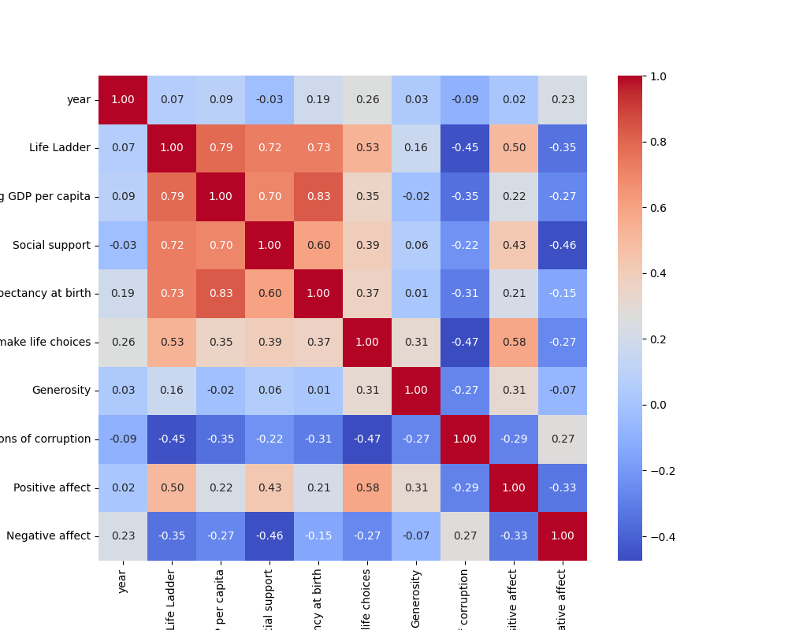

# Dataset Analysis Report
## Data Summary
```
              year  Life Ladder  Log GDP per capita  ...  Perceptions of corruption  Positive affect  Negative affect
count  2363.000000  2363.000000         2335.000000  ...                2238.000000      2339.000000      2347.000000
mean   2014.763860     5.483566            9.399671  ...                   0.743971         0.651882         0.273151
std       5.059436     1.125522            1.152069  ...                   0.184865         0.106240         0.087131
min    2005.000000     1.281000            5.527000  ...                   0.035000         0.179000         0.083000
25%    2011.000000     4.647000            8.506500  ...                   0.687000         0.572000         0.209000
50%    2015.000000     5.449000            9.503000  ...                   0.798500         0.663000         0.262000
75%    2019.000000     6.323500           10.392500  ...                   0.867750         0.737000         0.326000
max    2023.000000     8.019000           11.676000  ...                   0.983000         0.884000         0.705000

[8 rows x 10 columns]
```
## Insights from AI Analysis
Based on the provided dataset summary for Afghanistan from 2008 to 2017, we can derive various insights regarding the social, economic, and emotional wellbeing of the population as measured by different indicators such as the Life Ladder, Log GDP per capita, Social support, Healthy life expectancy, Freedom to make life choices, Generosity, Perceptions of corruption, Positive affect, and Negative affect.

### Insights:

1. **Life Ladder Index:**
   - The Life Ladder index, which reflects subjective wellbeing, exhibited fluctuations over the years.
   - It started at **3.724** in 2008 and peaked at **4.758** in 2010. However, it dropped to **2.662** in 2017, indicating a significant decline in perceived wellbeing towards the end of the period.

2. **Log GDP per Capita:**
   - Log GDP per capita showed a general increase from **7.350** in 2008 to a peak of **7.680** in 2013.
   - This suggests a gradual improvement in economic conditions until 2013, after which it stabilized and did not significantly drop, indicating some resilience in economic performance amid falling life satisfaction.

3. **Social Support:**
   - Social support increased from **0.451** in 2008 to a high of **0.559** in 2016 before slightly declining to **0.491** in 2017.
   - While there were fluctuations, the overall trend suggests that perceptions of social support improved over the years.

4. **Healthy Life Expectancy:**
   - Healthy life expectancy at birth improved steadily from **50.5 years** in 2008 to **53.25 years** in 2017.
   - This indicates that health outcomes improved for the Afghan population, even as other wellbeing measures declined.

5. **Freedom to Make Life Choices:**
   - This indicator decreased from **0.718** in 2008 to **0.389** in 2015, hitting its lowest point in 2017 at **0.427**.
   - The decline in freedom suggests a deteriorating perception of autonomy and personal agency amidst social and political challenges.

6. **Generosity:**
   - Generosity scored relatively low throughout the years, with slight variations but no significant improvement.
   - The lowest score was observed in 2013 at **0.059**, indicating limited willingness to contribute to communal support.

7. **Perceptions of Corruption:**
   - Perceptions of corruption graduated from **0.882** down to **0.771** by 2016 (inferred since the figure is cut-off in the data for 2017).
   - A decreasing trend can reflect either increasing governmental accountability or growing disillusionment with governance.

8. **Positive and Negative Affect:**
   - Positive affect showed a declining trend from **0.414** in 2008 to a low of **0.435** in 2017 with variations in the interim.
   - Conversely, positive affect remains higher when compared to negative affect, which increased from **0.258** in 2008 to **0.371** in 2017, signaling an increase in distress or dissatisfaction over the years.

### Conclusion:

The overall analysis of the dataset from 2008 to 2017 suggests a complicated picture for Afghanistan: 
- While economic conditions (Log GDP per capita and healthy life expectancy) demonstrate some improvements, the subjective measures of wellbeing and freedom to make choices show a concerning decline, particularly towards the end of the observed period.
- Despite increasing social support, the rising levels of negative affects indicate a growing public discontent or challenges faced by individuals despite improvements in some objective measures.

Overall, there appears to be a divergence between subjective wellbeing and certain objective indicators, reflecting potential societal instability or challenges that were likely exacerbated by external factors such as conflict or governance issues during these years.
## Data Visualizations

